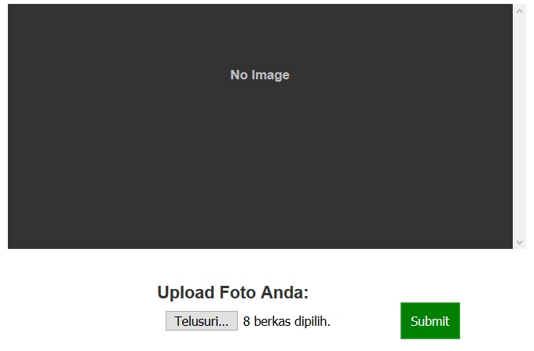

<h1>Multiple File Upload with AJAX JQUERY and PHP</h1>

 Preview File Upload 

<strong> Fitur </strong>

<ul>
	<li>Upload Gambar</li>
	<li>Hapus Gambar</li>
</ul>

Sumber : https://www.jurnalweb.com/tutorial-cara-upload-foto-dengan-ajax-dan-php-jquery/

Lalu saya kembangkan dengan menambahkan delete image menggunakan ajax
